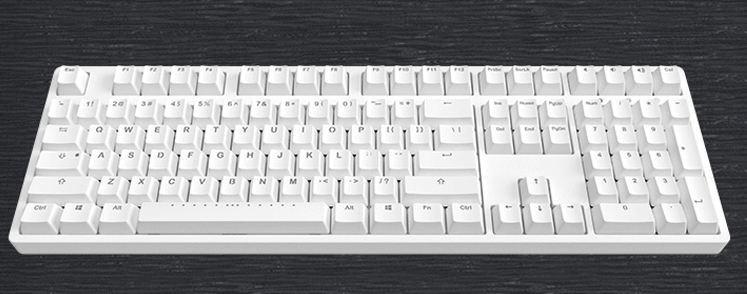

If you are like me a geek of prefering to use keyboard to operate your Windows system, then here is the right place for you.

The `goal` of MetaKB is described by the below gif:



MetaKeyboard is based on [AutoHostKey](https://autohotkey.com/).

# Quick start

- clone this repository:

```bash
git clone https://github.com/metaseed/metaKeyboard.git
```

- go to folder metaKeyboard and run metaKeyboard.exe

## Description

MetaKB redefined the CapsLock key as a function key:

- If you press it, it act like the ESC key;
- If you hold it and press another key, it acts like another `FUNCTION` key (like: <kbd>ctrl</kbd>, <kbd>alt</kbd>) for you.

> you can press CapsLock+` to toggle between normal CapsLock function and the new _function key_ function.

> below we use 'CL' to stands for the redefined `CapsLock` key

# Keyboard Map

> arrow keys are defined same as Vim

## Direction Keys Mapping Table

| Key  | Map        | Note |
| ---- | ---------- | ---- |
| CL+h | `Left`     |
| CL+j | `Down`     |
| CL+k | `Up`       |
| CL+l | `Right`    |
| CL+i | `Home`     |
| CL+o | `End`      |
| CL+u | `PageUp`   |
| CL+n | `PageDown` |

> The `LAlt(left Alt)` key combined with the keys in this table gives you a shortcut:
> i.e. if you want to press `Alt+Up` you could just press `LAlt+k`, no need to press `Alt+CL+k` together.

> Note: the `RAlt` still act as normal `Alt` key.

## Other Remapped Keys

| Key            | Map                        | Note                                                  |
| -------------- | -------------------------- | ----------------------------------------------------- |
| `CL+1..=`      | `F1..F12`                  | F1 -> CL+1 ... F10 -> CL+0, F11 -> CL+ -, F12 -> CL+= |
| `CL+Backspace` | `Delete`                   |
| `CL+;`         | `Context Menu`             | show context menu, like mouse right click             |
| `CL+b`         | `pause/Break`              |
| `CL+p`         | `PrintScreen`              |
| `CL+[`         | mouse `left` button click  |
| `CL+]`         | mouse `right` button click |

# Function and Software

## Frequently Used Function

| Key                                               | Map                                 | Note                                                          |
| ------------------------------------------------- | ----------------------------------- | ------------------------------------------------------------- |
| `Win+f`                                           | go to FileExplorer's files pane     | move focus to files pane of FileExplorer to manage files      |
| `Win+n`                                           | go to FileExplorers navigation pane | move focus to navigation pane of FileExplorer to manage files |
| `CL+\` |copy file full path| when in FileExplorer |
| `Ctrl+Alt+c`                                      | copy and search with search engine  | press `ctrl+c` and search with `Google`                       |
| `Ctrl+Alt+n`                                      | create new file in the folder       |
| `Win+v`                                           | open virtual machine manager        | configurable, default is Hyper-V                              |

### MetaKB related

| Key              | Function                                                                    |
| ---------------- | --------------------------------------------------------------------------- |
| `Ctrl+Win+Alt+l` | reload the metaKB software, environment variables and path would be updated |
| `Ctrl+Win+Alt+c` | close the metaKB software                                                   |

## Frequently Used Software

| Key          | Map                                                            | Note                                                                                                                                                                              |
| ------------ | -------------------------------------------------------------- | --------------------------------------------------------------------------------------------------------------------------------------------------------------------------------- |
| `CL+c`       | open the folder with _code_ editor                             | configuralbe, default is `VSCode`                                                                                                                                                 |
| `CL+d`       | show/hide your word dictionary software                        | in your favorite `dictionary` software config the hotkey `shift+alt+d` to toggle the software, and make sure to config your dictionary software auto start when windows starting. |
| `CL+e`       | edit file with configured editor                               | configurable, default is `gvim`                                                                                                                                                   |
| `CL+f`       | search in folder                                               | configurable, default is `everything` in the _software_ folder                                                                                                                    |
| `CL+t`       | open terminal                                                  | configurable, default is `Cmder` in the _software_ folder                                                                                                                         |
| `CL+w`       | open web explorer and navigate to your _searchEngine_          | configurable, default is `Google`                                                                                                                                                 |
| `CL+shift+w` | open web explorer and navigate to your _searchEngineSecondary_ | configurable, default is `Bing`                                                                                                                                                   |
| `CL+m s`     | start screen capture tool                                      | after starting, use the shortcut key config in the software to trigger screen capture.                                                                                            |
| `CL+m Alt+s` | start screen gif recorder                                      | configurable, default is `ScreenToGif` in the _software_ folder                                                                                                                   |
| `CL+m t`     | open task manager                                              | configurable, default is `ProcessExplorer` in the _software_ folder                                                                                                               |
| `CL+m r`     | screen ruler                                                   | configurable, default is `aruler` in the _software_ folder                                                                                                                        |
| `CL+m v`     | open all \*.sln files in the folder with visualStudio          | configurable                                                                                                                                                                      |

> configurable means could be configured in config.ini file

## Tricks

1. in file explorer, find the frequently used button on the Ribbon, and right click, select `Add to quick access toolbar`, base on the order, you can press `Alt+1..`to trigger this command. for example, I usually add the checkbox `Navigation pane` to the `quick access bar` so I can press `Alt+1` to show/hide it.

# Development

## Debug

to run the index.ahk file your need to install [AutoHotkey](https://autohotkey.com/download/), and run the follow command in the repository folder:

```
mklink config.ini .\metaKeyboard\config.ini /H
mklink software .\metaKeyboard\software /J
```

# Other Useful Programs and configuration

1. [VSCode](https://github.com/Microsoft/vscode) with plugins: Settings Sync, vim, metaGo....; configuration file is:
   GITHUB GIST: https://gist.github.com/metasong/b227db6a892b4c3ec1bb4900bc54977b. after install vscode and install the Settings Sync plugin, and sync settings with the gist file.
1. VisualStudio: the shortcut keys are reconfigured, configuratin is VSCode.vsk in the ./software/VisualStudioShortcut foler. Copy the VSCode.vsk into the folder: C:\Program Files (x86)\Microsoft Visual Studio 14.0\Common7\IDE or create a symble link point to to the VSCode.vsk pointing to it. and select the VSCode keyboard mapping scheme in your VS options: Environment/Keyboard config page. VS Extensions used: AceJump, Hide Main Menu Hot Commands for Visual Studio, Hot Keys - Keyboard Shortcuts, MixEdit, Resharper Ultimate,Visual Commander, VsVim
1. [ClipJump](https://github.com/aviaryan/Clipjump)
1. [Git for Windows](https://git-scm.com/download/win), except git tools, it provides a lot useful tools

# Appendix: Windows Useful Shortcuts

## Common

| Key                    | Note                                                                           |
| ---------------------- | ------------------------------------------------------------------------------ |
| `Alt+Tab`              | to switch between open apps, and using `LAlt+h,j,k or l` to select active app. |
| `Ctrl+Z/Y`             | Undo/Redo.                                                                     |
| `Alt+F4(Alt+CL+4)`     | Close active app.                                                              |
| `Alt+Space`            | show system menu, n(miNimize),r(Restore),x(maXimize),c(Close) window           |
| `Win+L`                | Lock Windows.                                                                  |
| `Win+D`                | Show desktop.                                                                  |
| `Win+I`                | Settings                                                                       |
| `Win+B`                | Show hiden icons                                                               |
| `Win+Number`           | Start the program pinned to the Taskbar.                                       |
| `Win+Shift+Left/Right` | move window to another screen                                                  |
| `Win+Up/Down`          | maximize/restore/minimize window                                               |

## File Explorer

| Key                                   | Function                                                                                                           | Note                                                              |
| ------------------------------------- | ------------------------------------------------------------------------------------------------------------------ | ----------------------------------------------------------------- |
| `F2(CL+2)`                            | Rename.                                                                                                            |
| `Ctrl+Shift+E`                        | Expand navigation pane to the current folder.                                                                      |
| `Ctrl+N`                              | Open a new window of the same folder.                                                                              |
| `Ctrl+Shift+N`                        | Create a new subfolder in the current folder.                                                                      | _use `Ctrl+Alt+n` to create new file_                             |
| `Ctrl+W`                              | Close the current window.                                                                                          |
| `Alt+Up`                              | Arrow Go up one level.                                                                                             |
| `Alt+Right`                           | Arrow Go forward.                                                                                                  |
| `Alt+Left`                            | Arrow Go back.                                                                                                     |
| `Alt+d`                               | Move the focus to the address bar, and select the current path. (press `Ctrl+c` to copy)                           |
| `Alt+p`                               | Preview panel                                                                                                      | `alt+1` to show navigation pane (when add it to quick access bar) |
| `Ctrl+arrow key` and `Ctrl+ Spacebar` | to move to an item and press Spacebar to select/unselect multiple individual items in window                       | `ctrl+arrow`: move while select; `ctrl+space`: toggle selection   |
| `Shift+arrow(Caps+ikjl)`              | continously Select more than one item in a window or on the desktop, or select text in a document                  |
| `Alt+Spacebar`                        | Show context menu of the active window.                                                                            |
| `F4(CL+4)`                            | Move the insertion point to the address bar, and display the contents of the drop-down list of previous addresses. |
| `F5(CL+5)`                            | Refresh.                                                                                                           |
| `Alt+Enter`                           | Show properties of the selected file.                                                                              |
| `Shift+F10(Shift+CL+0)(CL+;)`         | Open the shortcut menu for the current selection (which is the same as a right-click).                             |
| `Ctrl+Shift+1/2/.../8`                | View modes                                                                                                         | `Ctrl+Shift+3`: icons; `Ctrl+Shift+6`: details;                   |
| `Ctrl+F3(CL+3)`                       | go to search box, your could then press Tab go to navigation pane, then press Tab go to file list.                 | Note: replaced by everything                                      |
| `F11(CL+-)`                           | Toggle full-screen mode.                                                                                           |
| `Ctrl+E or Ctrl+F then Esc`           | select the file pane(works for file explorer and open/save dialog)                                                 |

## Virtual desktops

| Key                           | Function                 | Note |
| ----------------------------- | ------------------------ | ---- |
| `Win+Ctrl+d`                  | Add Dessktop             |
| `Win+Ctrl+F4(CL+4)`           | Close desktop            |
| `Win+Ctrl+Right/Left(CL+l/j)` | Switch to right/left one |

## Dialog box

| Key                           | Function           | Note |
| ----------------------------- | ------------------ | ---- |
| `Ctrl+Tab` `(Ctrl+Shift+Tab)` | to switch tabs     |
| `spacebar`                    | to toggle checkbox |
| `Alt+Down`                    | show dropdown list |
